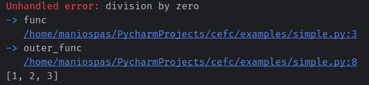

# CEfC

A *call-effect-commit* schema for safe data management in Python.

This a metaprogramming framework that enables the safe execution
of Python code by tracking data modifications and commiting to them
only after functions complete their runs without errors. You can 
create fast-failing services that can rerun with new inputs from the
same uncorrupted state. 

The framework also treats exceptions-as-values, meaning that you can
check the validity of return arguments if you want, otherwise they
are cascaded throughout service calls.


## :zap: Quickstart

Install *CEfC* per `pip install cefc`. Then create and run the
following code snippet - code hints are not mandatory:

```python
from cefc import service

@service
def func(a:list, b: int):
    a.append(4)
    a[2] = 100
    a[0] = 1
    a[0] /= b

@service
def outer_func(a:list, b:int):
    a[1] = 100
    return func(a, b)

a = [1,2,3]
outer_func(a, b=0)
print(a)
```

You will see the following output, where `a` is unaffected by would-be
modifications and there is a final warning about not having handled the
division-by-zero error at any point. More on error handling later.




Also consider a more complicated case where an object (for now:
without magic methods) is set as a service argument. No modification
occurs on failure.

```python
from cefc import service

class ValueWrapper:
    def __init__(self, value):
        self.value = value
    def inc(self):
        self.value += 1
        return self.value

@service
def incinv(a):
    return 1.0/a.value.inc()

a = ValueWrapper(ValueWrapper(-1))
print(incinv(a))
print(a.value.value)
```


## :hammer_and_wrench: Safe types

This is a list of types whose safety is (planned to be) guaranteed 
when presented as service arguments. Note that the safety of global state 
is not guaranteed, but globals can be passed as preset arguments too.

- [x] list
- [x] dict
- [ ] numpy array or GPU tensor
- [x] object (no magic functions)